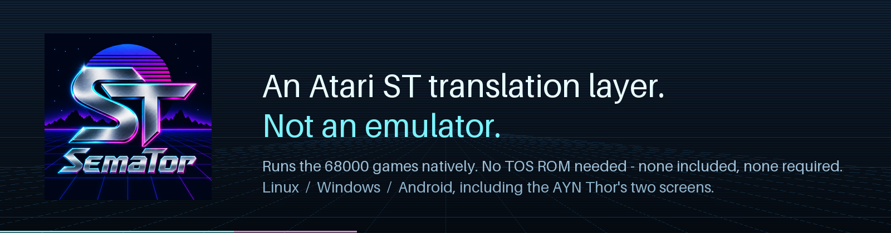
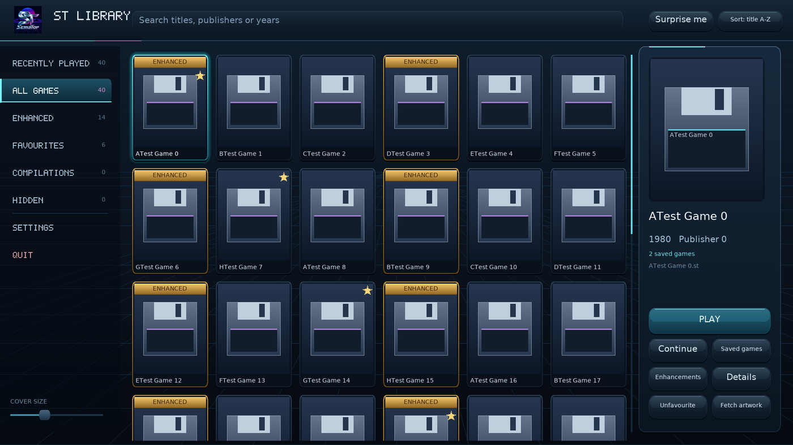
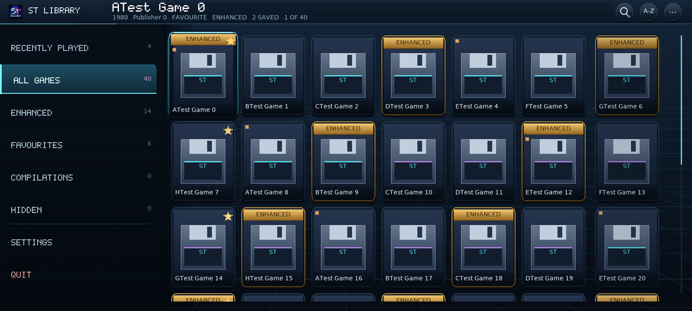
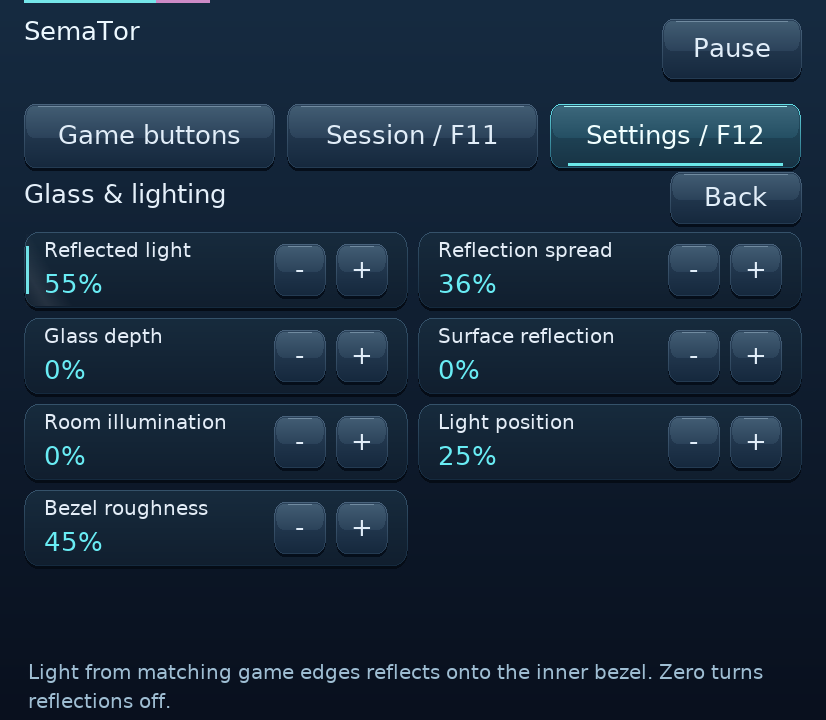

# SemaTor

**An Atari ST translation layer. Not an emulator.**

SemaTor runs Atari ST games by translating them: the 68000 code executes,
the ST's hardware and operating-system interface are reproduced, and where
a game's hot routines are understood they can be replaced with native code
that does the same job faster. There is no Atari TOS ROM inside it and none
is required — the GEMDOS, BIOS and XBIOS calls a game makes are answered by
SemaTor's own implementations, written from scratch for this project.

You supply the disk image. SemaTor supplies the machine.

> **What it contains none of:** no Atari TOS ROM, no game code, graphics,
> audio or data of any kind, and no source from any other emulator. The full
> statement ships with every download as `COPYRIGHT.txt`.

<p align="center">
  <a href="https://discord.gg/DdHfSGrdFc"><b>Discord</b></a> &nbsp;·&nbsp;
  <a href="https://www.youtube.com/@SemaTorST"><b>YouTube</b></a> &nbsp;·&nbsp;
  <a href="https://github.com/SirBaron/SemaTor/releases/latest"><b>Latest release</b></a>
</p>

---

## What makes it different

**It is not trying to be a general-purpose ST.** Emulators aim to run
everything by being a faithful machine. SemaTor aims to run *games* well —
and for the ones it knows, better than the original hardware could — by
understanding what the game is doing and meeting it halfway.

- **Native routines, audited against the original.** A game profile can
  mark hot 68000 routines — a raster loop, a sprite blit, a sound driver —
  for replacement by native code. `--audit-native` runs both the native
  routine *and* the 68000 code it replaces, keeps the 68000 answer, and
  reports every disagreement. A replacement cannot change behaviour without
  being caught.
- **Enhancements, per game.** Where a game is understood, its profile can
  offer things the ST never had: cleaner scrolling, extended play areas
  (Arkanoid II's wide mode), audio fixes, cheats. Each is a switch, on or
  off, and `--safe` turns them all off.
- **No TOS.** The operating-system interface is documented behaviour, and
  SemaTor implements it. That is why it needs no ROM — and why it is not a
  copy of one.
- **Frame generation.** Optional generated in-between frames, on the GPU,
  with a native optical-flow path on NVIDIA and a compute path elsewhere.
- **Presentation built for the ST's picture.** Sharp pixels, simple
  filters, or a full CRT studio — beam, phosphor, mask, glass, colour —
  with HDR output where the display offers it, and beam-accurate timing on
  Android through `VK_GOOGLE_display_timing`.
- **Written from scratch, and shown to be.** The 68000 interpreter, the
  video and YM2149 and MFP, the WD1772 and its disk formats, the ACIA and
  IKBD, the scheduler, the cycle clock, the profile system, the debugger
  and the test suites. `docs/PROVENANCE.txt`, in every download,
  records the similarity measurements taken against other emulators.

---

## Platforms

| | |
|---|---|
| **Linux** | x86-64 binary. Needs only SDL2 (SDL2_image optional, for cover art). |
| **Windows** | `SemaTor.exe` with `SDL2.dll` beside it. |
| **Android** | arm64 APK. Phones, and dual-screen handhelds — on the **AYN Thor** the game runs on the top screen while the F11/F12 menus, the controls and a per-game page live on the lower one. |

Debug builds ship for Linux and Windows alongside the release builds; they
write a continuous machine trace per game session.



<sub>Screenshots show SemaTor's own placeholder disks, not game artwork — no
game content is included with SemaTor, and none is shown here.</sub>

---

## Features

### The library
- A menu of lists — recently played, all games, enhanced, favourites,
  compilations, hidden — with one list on screen at a time.
- Cards that carry their own name, a brass **ENHANCED** plate on any game
  with a profile, and a mark for saved games; the focused game described
  beside them.
- Cover art fetched per game or for the whole collection, from
  libretro-thumbnails, with your own covers kept.
- Search as you type, an A–Z jump that offers only the letters you own games
  under, sort by title, year, publisher or last played, and *Surprise me*.
- Saved games with previews, and *Continue* straight into the latest.
- A desktop layout with a permanent details rail, hover, mouse-wheel
  scrolling and a cover-size slider; a phone layout built for a thumb; and
  the AYN Thor's second screen used as a disk sleeve for the chosen game.
  Console-style and classic desktop layouts are a keypress apart (F9).
- Starting a game flies its cover into the dark before the ST takes over.



### The machine
- 68000 interpreter with cycle clock and scheduler; ST video, YM2149, MFP,
  ACIA/IKBD, and the WD1772 with **ST / IMG, MSA, full-sector DIM and
  Pasti STX** disk images.
- GEMDOS, BIOS and XBIOS implemented directly — no TOS ROM.
- Companion disks: when a game asks for another disk, insert it from the
  menu without leaving the game.
- Save states with previews, ten slots per game, and rewind.
- Joystick, keyboard and mouse; game controllers with per-game mappings;
  an on-screen analogue stick and buttons on phones.

### The picture
- **Sharp pixels**, **simple filters** (scanlines, blur, glow, curvature,
  mask, motion) and a **CRT studio** — beam, phosphor persistence, mask
  type, tube glass and reflections, calibration — each a page of steppers.
- **HDR** output where the display supports it, with white and peak
  controls.
- **Frame generation** with an NVIDIA optical-flow path (`VK_NV_optical_flow`)
  and a GPU compute path for everything else; native frames are always one
  press away.
- OpenGL and Vulkan back ends; on Android, native Vulkan presentation with
  beam timing.



### Sound
- YM2149 with the game's own sound driver observed, so effects and music
  are what the game intended; a mixer that records to WAV on request.

### For understanding games
The debugger is part of the product, not a build option:
`--debug-log` (continuous machine trace with hot code and stall detection),
`--watch-writes` ("what writes this?"), `--find-vars` (which words behave
like engine counters), `--watch-range`, `--trace-state`, `--trace-io`,
`--capture` and `--frames-to` for watching a title sequence frame by frame,
scripted input with `--press`, `--joy` and `--mouse`, and `--stress-gameplay`
for soak testing. `--inspect` says what is on a disk and exits.

---

## Games with profiles

A profile teaches SemaTor a specific game: what its routines are, which can
go native, what enhancements fit it, and how its sound driver works.
Profiles identify a game by the hash of its program, not by its file name.

| Game | |
|---|---|
| Arkanoid II: Revenge of Doh | native routines, wide mode, enhancements |
| Black Lamp | |
| Return to Genesis | audio |
| SWIV | |
| Turrican II | |
| Xenon | sound driver |
| Xenon 2: Megablast | |
| Zynaps | |

Everything else runs through the interpreter and the hardware layer. Many
games work; some will not, and a game without a profile gets none of the
native or enhancement work. See the caveats below.

---

## Caveats — read these

- **No games are included. None ever will be.** You need your own disk
  images. Put them in a folder and point SemaTor at it (`--dir`, or add the
  folder from the library).
- **No TOS ROM is needed, and none is included.** This is a design choice,
  not a gap: the operating-system interface is reproduced, not copied.
- **Compatibility is per game.** Eight titles have profiles and have been
  worked on in depth. Anything else is running on the general machine and
  may be perfect, imperfect or not start at all. A disk that decodes but
  has no recognised startup is reported as such rather than guessed at.
- **It is a translation layer.** Where a native routine has replaced 68000
  code, the two have been audited against each other — but a profile is a
  claim about a specific game, and a modified or unusual version of that
  game may not match it.
- **Frame generation is optional and, on mobile, experimental.** Original
  frames are recommended there and are one press away.
- **NVIDIA optical flow needs an NVIDIA GPU and driver that expose
  `VK_NV_optical_flow`.** Elsewhere the compute path is used automatically.
- **Simple filters and the CRT studio depend on the GPU driver.** The
  chain checks its own output and steps aside if a driver produces nothing,
  rather than leaving a black screen.
- **Cover art comes from the network** (libretro-thumbnails) and only when
  you ask for it. Nothing is fetched without a press.
- **Android needs "All files access"** so it can read your games folder in
  internal storage. Everything lives under `SemaTor/` in the PC layout.
- **Not legal advice.** COPYRIGHT.txt says what the code is and is not; it
  was written by the people who built it, not by lawyers.

---

## Getting started

**Linux**
```sh
chmod +x semator-linux-x86_64        # downloads arrive without the execute bit
./semator-linux-x86_64               # run from a terminal the first time
```
or `sh run-semator.sh`, which does the chmod and names the SDL2 package for
your distribution.

**Windows** — run `SemaTor.exe` with `SDL2.dll` beside it.

**Android** — sideload the APK, grant "All files access", drop disks into
`Internal storage/SemaTor/games`.

Then add your games folder in the library, or:
```sh
./semator-linux-x86_64 --disk "Xenon 2.st"
```

Full notes ship with the download: `RUNNING.txt` for each platform and
`INPUT.txt` for the controls.

---

## About the source

SemaTor's source is not published. The releases here are the finished
binaries, built from one tree for Linux, Windows and Android, and every
release is checked against the project's own test suite — several hundred
targets covering the 68000 core, the hardware layer, the disk formats, the
audio, the GPU chains and every interface layout at every screen shape.

Faults and compatibility reports are very welcome through
[Issues](https://github.com/SirBaron/SemaTor/issues) or on Discord, and get
looked at properly — see the templates for what makes a report easy to act
on.

---

## Come and say hello

- **Discord** — https://discord.gg/DdHfSGrdFc — questions, game reports, and
  what is being worked on.
- **YouTube** — https://www.youtube.com/@SemaTorST — the thing running, which
  is worth more than any description of it.
- **Issues** — bugs and compatibility reports. The templates ask for the logs
  and for which earlier version worked, because that is what turns a search
  into a diff.

## Credits and licence

SemaTor © David Baron. Written from scratch. All rights reserved — see
[LICENSE](LICENSE): the binaries are free to download and use, and the code
is not licensed for reuse.

It links against SDL2 and, optionally, SDL2_image, and includes the Vulkan
headers and stb_image, which carry their own licences — `docs/LICENSING.txt`
in the download has the detail. What SemaTor does and does not contain is set
out in `COPYRIGHT.txt`, which ships with every release.

Atari and Atari ST are trademarks of their respective owners. This project
is not affiliated with them.
