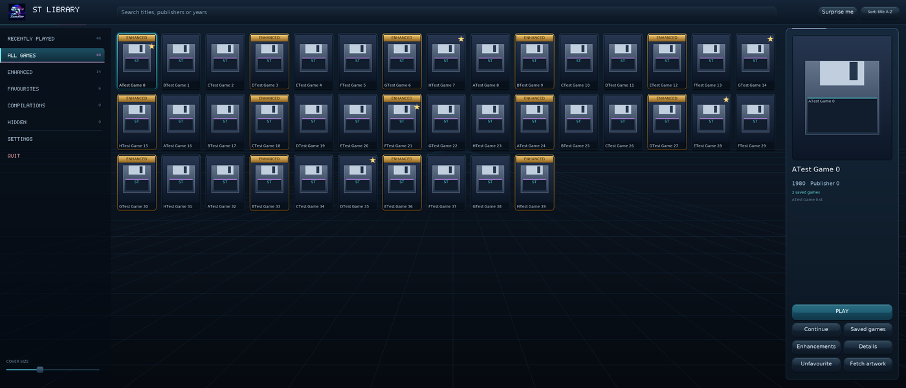
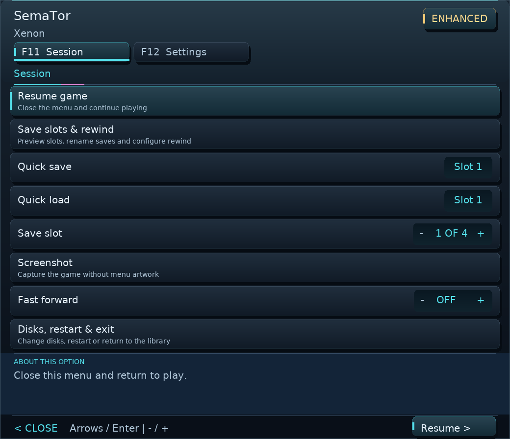
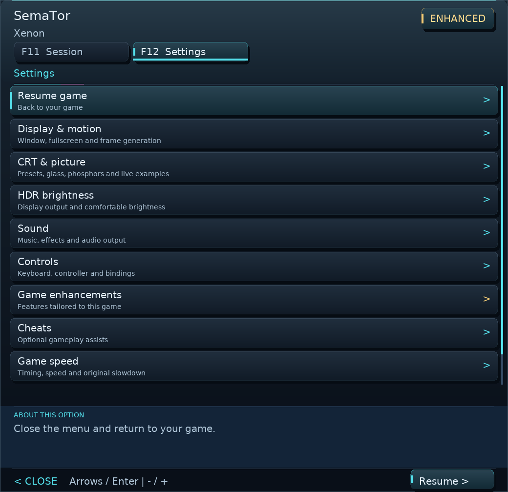

# SemaTor

**Your Atari ST library. A new way to play.**

SemaTor is an Atari ST translation layer: it runs 68000 game code, reproduces the hardware and operating-system interfaces it needs, and adds native enhancements for supported titles. No Atari TOS ROM is required.

Created by David Baron with AI assistance in development, research, documentation and this website.

[Download the public preview](https://github.com/SirBaron/SemaTor/releases) · [Website](https://sirbaron.github.io/SemaTor/) · [Discord](https://discord.gg/DdHfSGrdFc) · [YouTube](https://www.youtube.com/@SemaTorST) · [Report a problem](https://github.com/SirBaron/SemaTor/issues)

**1.1.222 public preview — Linux x86-64 and Windows x64.** This repository hosts the website, public documentation and issue tracker. SemaTor's source is private.

Check for newer desktop builds under **Library Settings → Updates**. Optional daily startup checks include public previews. Choose **Download update**, then **Install and restart**: signed Linux/Windows updates preserve your games, saves, settings and custom artwork. GitHub downloads remain available. Install 1.1.219 or newer manually once to enable in-app installation of future signed releases.

## A library that feels like home

Browse covers or lists, search your collection, keep favourites and return to recently played games. Supported titles stand out with a gold **ENHANCED** badge. Add game folders and choose custom covers using a file browser; fetch artwork for one game or the whole library.

*Current desktop UI rendered with sample entries and placeholder covers; no games are bundled.*

*Room for a larger collection on a wider display.*

## Make it your ST

- **Enhanced titles:** per-game options for supported games, including native improvements, sound options and cheats where available. Recognised untested editions can use their title profile with an on-screen warning. Features may not work correctly on every disk edition.
- **Picture controls:** sharp pixels, simple filters and CRT presets with controls for the look of the screen and bezel.
- **Smoother motion:** optional frame generation, with availability and results depending on the graphics backend, GPU and driver.
- **Pick up where you left off:** four manual save slots with previews, plus rewind and session features where supported.
- **A more comfortable desktop:** F11/F12 menus keep Resume, Library and Quit in the header. Click them, or use LB/RB then A on a gamepad. **F11 → Controls for this game** shows live button mappings and supported game-specific notes. Public builds include basic diagnostics and an optional local support report.
- **Your own disk collection:** ST, IMG, MSA, full-sector DIM, STX and supported disk images inside ZIP archives.

*Desktop header actions stay within reach: click, or use LB/RB then A. Sample game label shown.*

*F12 settings in the public build.*

## Install the desktop preview

| Platform | Release attachment | Start here |
| --- | --- | --- |
| Linux x86-64 | `SemaTor-1_1_222-linux-public-preview.zip` | Extract, open a terminal in that folder and run `sh install.sh`. The default installation is `~/Games/SemaTor`. |
| Windows x64 | `SemaTor-1_1_222-windows-public-preview.zip` | Extract the whole ZIP to a writable folder, then run `SemaTor.exe`. Keep `SDL2.dll` beside it. |

The Linux installer copies the application into its installation folder; it does not rely on a link back to Downloads. Double-clicking a shell script may open an editor, depending on your file manager. Running `sh install.sh` executes it directly. Linux requires an SDL2 runtime and Python 3 for installation.

**Library maintenance:** Settings → Refresh library (or F5) rechecks your collections. Removing a collection folder removes its entries immediately; your game files stay where they are.

**Optional drive sounds:** F12 → Sound → ST Drive Sounds adds floppy-drive noise during virtual disk activity. Switch it off there, or adjust Effects / speech volume.

Keep your **Games**, **Media** and **User** folders when updating. Games holds your disk collection, Media holds artwork and runtime resources, and User holds settings and saves. Add your game folders from the library after starting the app.

**Bring your own disk images.** No commercial game disk images or Atari TOS ROM are supplied. Compatibility varies by game and disk edition. This is a first public preview: Linux has received hands-on testing; Windows has been built and checked automatically but still needs broader real-machine testing.

## Phone and dual-screen development

Android and AYN Thor interfaces are also in development. They are **not included in this desktop public release**. These earlier development screenshots show the phone library and lower-screen interface; their appearance may change.

## Help improve compatibility

Open a [bug or game report](https://github.com/SirBaron/SemaTor/issues). Include the SemaTor version, OS, GPU and driver, game and disk edition, steps to reproduce, relevant CRT/frame-generation/sound settings, and the last version that worked if known. Screenshots help. An optional report is available under **F12 → Support & diagnostics**; review it before attaching. Please do not upload game disks or ROMs.

## Credits and licence

SemaTor © 2026 David Baron. All rights reserved; see [LICENSE](./LICENSE). Third-party notices are included under `Media/licenses` in the public builds. Atari and Atari ST are trademarks of their respective owners. SemaTor is not affiliated with Atari.

When a newer desktop release is found, a highlighted **Update available** button stays in the library header. Select it to download the update, then choose **Install and restart**.
