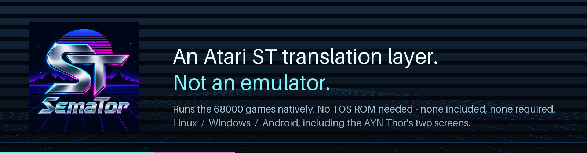
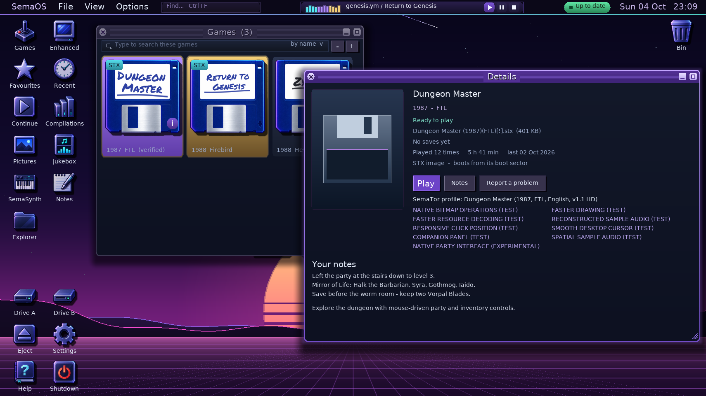
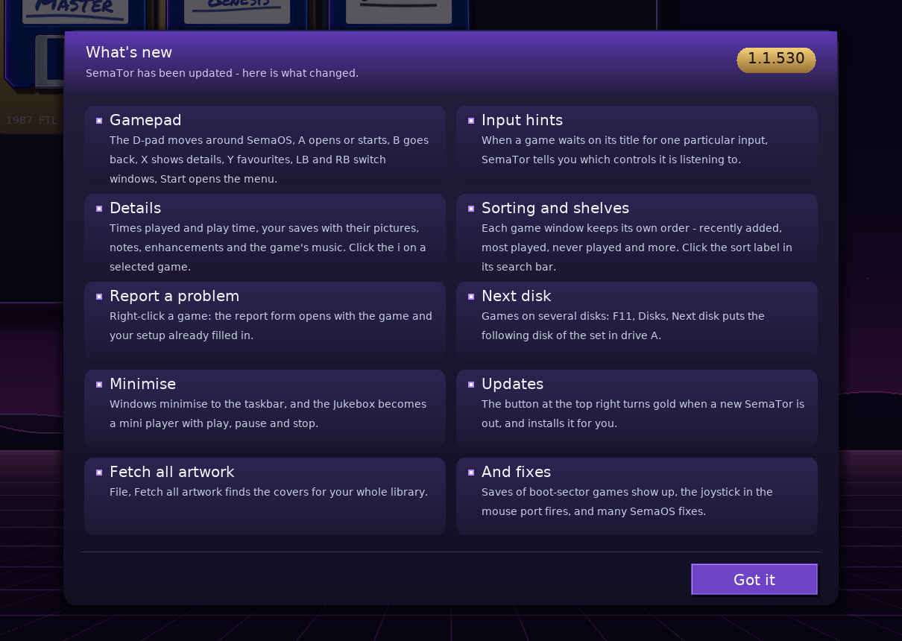
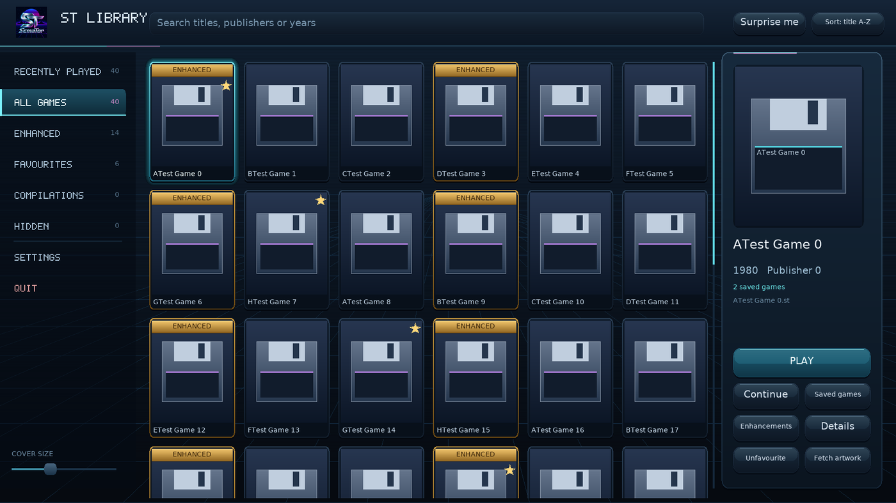
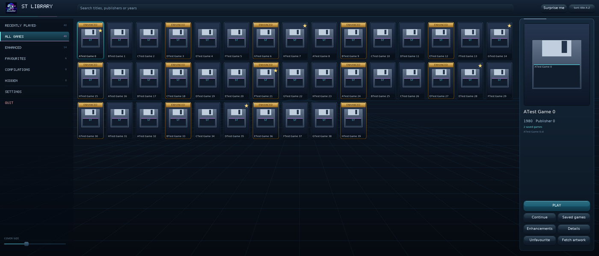
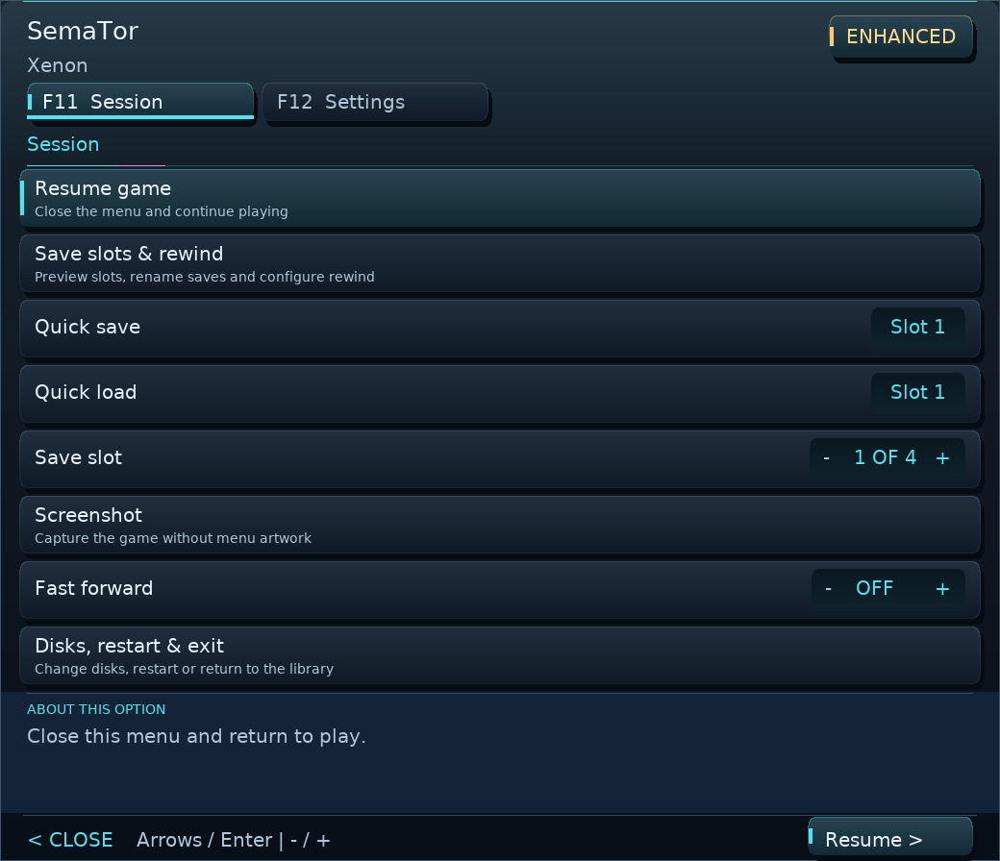
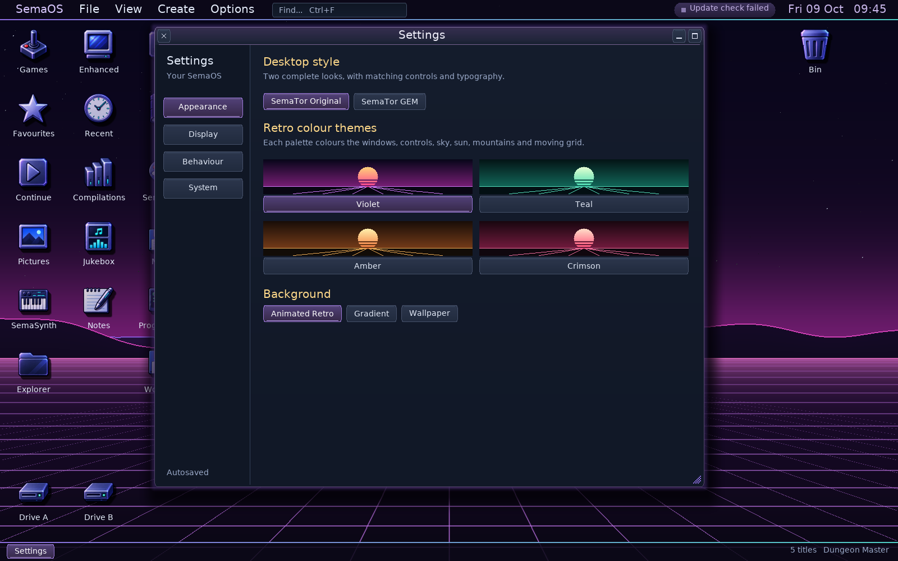
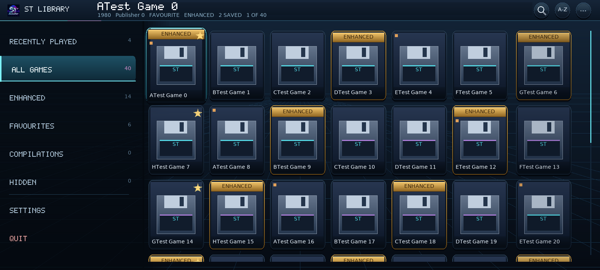
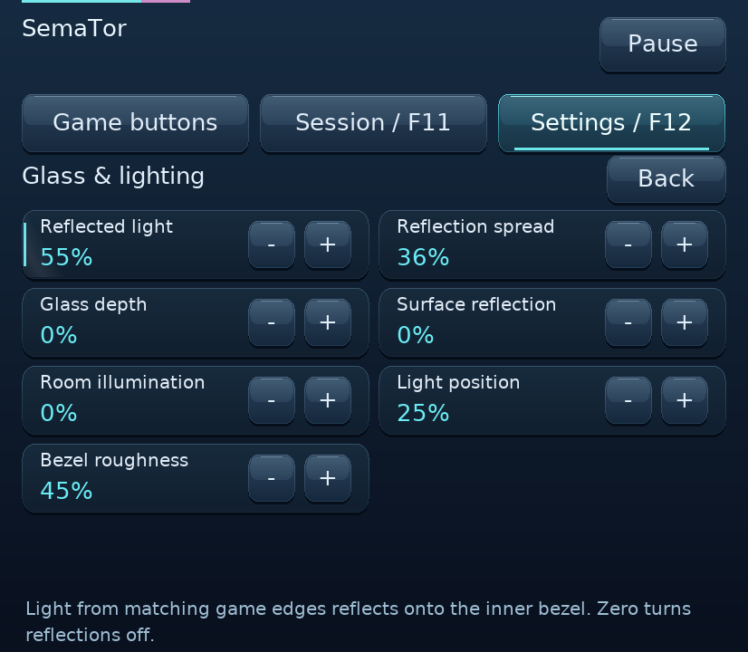

# SemaTor

**Your Atari ST library. A new way to play.**

SemaTor is an Atari ST translation layer: it runs 68000 game code, reproduces the hardware and operating-system interfaces it needs, and adds native enhancements for supported titles. No Atari TOS ROM is required.

Created by David Baron with AI assistance in development, research, documentation and this website.

[Download the public preview](https://github.com/SirBaron/SemaTor/releases) · [Website](https://sirbaron.github.io/SemaTor/) · [Discord](https://discord.gg/DdHfSGrdFc) · [YouTube](https://www.youtube.com/@SemaTorST) · [Report a problem](https://github.com/SirBaron/SemaTor/issues)

**1.1.545 public preview — Linux x86-64 and Windows x64.** This repository hosts the website, public documentation and issue tracker. SemaTor's source is private.

**1.1.545:** Linux starts without an accidental AVX-512 requirement. Library identities survive updates, failed disk checks retry after relevant core changes, and artwork downloads can target one SemaOS window. Workshop and Synth browsing are faster, recording avoids disk I/O in the audio callback, and idle desktop CPU use is reduced. [Changes since 544](./CHANGELOG.md).

**Updating:** in SemaOS, the button at the top right of the menu bar shows where you are - green **Up to date**, or gold **Update available** when a new SemaTor is out. Select it to download (with progress), then **Install update and restart**. The classic library has the same button in its header, and **Library Settings → Updates** for the daily check. Signed Linux/Windows updates preserve your games, saves, settings and custom artwork. GitHub downloads remain available. Public updates omit optional artwork.

## Highlights and recent changes

**1.1.544: the expanded SemaOS studio.** Paint adds a subtle grid, snap, selections, transforms and supported artwork editing into a separate disk copy. Maker saves editable projects with their assets. Explorer, Notes, Viewer and Workshop gain practical editing and navigation features, with save reliability and layouts reviewed in both themes.

**1.1.536: more disks run.** Damaged first file tables, boot-sector disk shapes, menu games loaded as on an ST, keyboard-check timing, and save states that put a game's second disk back by themselves.

**1.1.535: 99 profiles for 75 games.** Twelve new profiles for more versions of the profiled games, folder-exact program starts, lettered disk sets that change by themselves, and save states that say which disk they need.

**1.1.534: fixes.** Profile options beyond the 16th work, programs chosen from SemaOS find their files, profiles found through a launcher wait for the game, Out Run loads its title in 15 seconds and keeps widescreen under its menu.

**Super ST colour and frame generation everywhere.** Super ST colour shows a game at 2x-4x its pixel count with smooth shades and sharp outlines; frame generation now works at any picture size - widescreen views, medium and high resolution, opened borders - including NVIDIA optical flow. Auto HDR for the CRT cabinet.

**99 enhancement profiles for 75 games.** Out Run gets widescreen and smooth 3D; [see every profile and the disk it was made for](https://sirbaron.github.io/SemaTor/games/profiles.html). When a game has several versions, SemaTor starts the one its profile was made for.

**Create on the ST.** SemaPaint, the Maker (your own Atari ST intro or game disk), the Code Reader, a Hardware Check and SemaSynth export - plus a GEM-style look for SemaOS.

**SemaOS with a gamepad.** The D-pad moves a focus over the whole desktop - icons, menus, buttons, games - A opens or starts, B goes back, X shows details, Y favourites, LB / RB switch windows, Start opens the menu.

**A desktop that keeps up.** Windows minimise to the taskbar and the Jukebox becomes a glowing mini player in the menu bar; the button at the top right says when a new SemaTor is out and installs it; each game window keeps its own order; many SemaOS fixes.

**Every game in one place.** Details shows how often and how long you have played, your saves with their pictures, your notes, the enhancements and the game's music; new shelves list what was added recently, what you play most and what you have never tried. Report a problem from any game's menu, and a hint appears when a game waits on its title for one particular input.

**Most ST disks now run.** Games, demos and menu disks that never started do now. SemaTor's start-up follows TOS's own: the AUTO folder on every boot, programs where TOS loads them, the boot sector's stack, the reset vector. The 68000 runs to the ST's bus timing, so counted delays, raster effects and opened borders land where they should. SemaTor is tested against a library of over 14,000 disks.

**SemaOS is how SemaTor starts.** A desktop of its own opens first, with Games, Drives, Music, Pictures, Notes and more. Prefer the classic library? Switch under Settings.

**Music on the ST, old and new.** The Jukebox browses the SNDH archive and plays tunes live, with channel scopes and favourites. SemaSynth is a music studio that makes what real ST tunes make: play it from a MIDI keyboard and save your songs as real SNDH tunes.

**Your disks, labelled.** Handwritten labels like a copy from a mate, covers for every disk of a game, and a card size you choose.

**SDL3, carried with it.** Nothing to install for graphics or sound on Linux. On Wayland the window no longer freezes when it is covered.

**Optional Dungeon Master artwork:** the artwork add-on is shared on the [SemaTor Discord](https://discord.gg/DdHfSGrdFc). Extract its ZIP into the SemaTor application folder. It creates `Add-ons/dungeon-master`. Restart and enable Native Party Interface under F12 → Enhancements. Main program downloads omit this artwork. Existing artwork installations remain supported.

Dungeon Master's optional native interface remains available for wider testing and is still experimental.

Read the [release notes and testing guidance](./CHANGELOG.md).

## SemaOS - a desktop for your ST collection

*SemaOS with a Games window, Details of the selected game and the Jukebox minimised into the menu bar. Your own disks are shown with SemaTor's handwritten labels; the notes and play statistics here are sample data. No games are bundled.*

SemaTor starts in **SemaOS**, a desktop of its own in the spirit of the ST. Everything is an icon, a window or a menu away - with the mouse, the keyboard or a gamepad.

- **Your games, your order.** Games, Enhanced, Favourites, Compilations and Recent windows. Type to search; each window keeps its own order - name, year, publisher, recently played, recently added, most played or never played. Disks wear handwritten labels or their covers, at a card size you choose (- / +).
- **Details for every game.** Times played and time spent, your saves with their pictures (click one to carry on), your notes, the SemaTor profile and its enhancements, and the game's music - with Play, Continue, Notes, Music and Report a problem as buttons. Click the **i** on a selected game.
- **Continue** lists every game you have saved, newest first, with a picture of the save.
- **Drive A and Drive B.** Drag a game onto a drive, look inside the disk, start any program on it, or add a second disk.
- **Jukebox.** The games' music and the SNDH archive of ST tunes, played live, with favourites. Minimise it and it becomes a mini player in the menu bar with a glowing three-channel visualiser, play, pause and stop.
- **SemaSynth.** A three-channel music studio that makes what real ST tunes make. Play it from a MIDI keyboard and save your songs as real SNDH tunes.
- **Notes, Pictures, Explorer, Documents, Disk Workshop, Program Lab.** Your notes for each game, your screenshots, the folders on your computer, the text files on your disks, a disk editor that copies files onto and off .ST images (the original is never changed), and a 68000 assembler whose program goes straight onto a new disk.
- **Find (Ctrl+F)** searches windows, settings, games, your SemaSynth songs, the Jukebox and the SNDH archive at once.
- **Make it yours.** Wallpapers (the retro scene is the default), accent colours, icon sizes, disk labels, a screensaver. Windows snap, maximise and minimise to the taskbar.
- **A gamepad is enough.** The D-pad moves a focus ring over anything that can be clicked: A opens or starts, B goes back, X shows Details, Y favourites, LB / RB switch windows, Start opens the menu, Back opens Find.
- **What's new** appears once after an update, and offers your previous look back if an update changed SemaOS's defaults.

Prefer the classic library? **Settings → Start in** chooses SemaOS or the library.

*What's new, shown once after an update.*

## Game guides

Browse the [Enhanced Games overview](https://sirbaron.github.io/SemaTor/games/) for guides to the best-known enhanced games, and the [list of all 99 profiles and their disks](https://sirbaron.github.io/SemaTor/games/profiles.html). Each guide lists the game's options, its original controls and an interactive SemaTor controller showing the default mappings. Saved remaps take priority.

## The classic library

The library SemaTor had before SemaOS is still here. Browse covers or lists, search your collection, keep favourites and return to recently played games. Supported titles stand out with a gold **ENHANCED** badge. Add game folders and choose custom covers using a file browser; fetch artwork for one game or the whole library.

*Desktop UI example rendered with sample entries and placeholder covers; no games are bundled.*

*Room for a larger collection on a wider display.*

## Make it your ST

- **Enhanced titles:** per-game options for supported games, including native improvements, sound options and cheats where available.
- **Picture controls:** sharp pixels, simple filters and CRT presets with controls for the look of the screen and bezel.
- **Smoother motion:** optional frame generation, with availability and results depending on the graphics backend, GPU and driver.
- **Pick up where you left off:** four manual save slots with previews, plus rewind and session features where supported.
- **A more comfortable desktop:** F11 is an overlay along the bottom of the game - save and load with a picture of every slot, rewind, disks and controls, with Resume, Library and Quit on its bar. Arrow keys or the D-pad reach every button. **F11 → Controls** shows the live controller picture with each button's action in the game you are playing. Public builds include basic diagnostics and an optional local support report.
- **Your own disk collection:** ST, IMG, MSA, full-sector DIM, STX and supported disk images inside ZIP archives.

*Desktop header actions stay within reach: click, or use LB/RB then A. Sample game label shown.*

*F12 settings in the public build.*

## Install the desktop preview

| Platform | Release attachment | Start here |
| --- | --- | --- |
| Linux x86-64 | `SemaTor-1_1_545-linux-public-preview.zip` | Extract, open a terminal in that folder and run `sh install.sh`. The default installation is `~/Games/SemaTor`. |
| Windows x64 | `SemaTor-1_1_545-windows-public-preview.zip` | Extract the whole ZIP to a writable folder, then run `SemaTor.exe`. Keep `SDL3.dll` beside it. |

The Linux installer copies the application into its installation folder; it does not rely on a link back to Downloads. Double-clicking a shell script may open an editor, depending on your file manager. Running `sh install.sh` executes it directly. SemaTor carries its own SDL3; Linux needs only Python 3 for the installer.

**Library maintenance:** Settings → Refresh library (or F5) rechecks your collections. Removing a collection folder removes its entries immediately; your game files stay where they are.

**Optional drive sounds:** F12 → Sound → ST Drive Sounds adds floppy-drive noise during virtual disk activity. Switch it off there, or adjust Effects / speech volume.

Keep your **Games**, **Media**, **User** and **Add-ons** folders when updating. Games holds your disk collection, Media holds artwork and runtime resources, and User holds settings and saves. Add your game folders from the library after starting the app.

**Bring your own disk images.** No commercial game disk images or Atari TOS ROM are supplied. Most ST disks run; if one does not, please report it. This public release continues the preview series: Linux has received hands-on testing; Windows has been built and checked automatically but still needs broader real-machine testing.

## Phone and dual-screen development

Android and AYN Thor interfaces are also in development. They are **not included in the desktop downloads**. Earlier ARM64 test builds include Mega lo Mania controls for Thor. No 1.1.302 APK is included; the Android fixes still need a full build and physical-device validation. These earlier development screenshots show the phone library and lower-screen interface; their appearance may change.

## Help improve compatibility

In SemaOS, right-click a game (or open its Details) and choose **Report a problem**; in the classic library use its action menu or press **U**. Either opens a prefilled GitHub draft. The compatibility notice also offers **Request compatibility check** before launching. You review and submit the draft using your GitHub account; no disks or logs are uploaded automatically.

Open a [bug or game report](https://github.com/SirBaron/SemaTor/issues). Include the SemaTor version, OS, GPU and driver, game and the disk's name, steps to reproduce, relevant CRT/frame-generation/sound settings, and the last version that worked if known. Screenshots help. An optional report is available under **F12 → Support & diagnostics**; review it before attaching. Please do not upload game disks or ROMs.

## Credits and licence

SemaTor © 2026 David Baron. All rights reserved; see [LICENSE](./LICENSE). Third-party notices are included under `Media/licenses` in the public builds. Atari and Atari ST are trademarks of their respective owners. SemaTor is not affiliated with Atari.

### Source reconstruction

F12 > CRT & picture > Simple screen filters includes optional per-game dither blending, gentle gradients and corner smoothing. These process completed source pictures before frame generation and work independently of CRT mode. Split comparison temporarily suspends interpolation. Effects default off. Xorg reconstructs GPU endpoints and uses RGB blending for its CPU fallback when enabled. Dungeon Master reconstructs the guest source; native HD artwork stays separate.

Drive B is independent of A: use **Session & exit** to insert/eject a companion, or `--disk-b FILE` to mount another image. **Sound > MIDI synthesis** enables the optional procedural synth; no external sound bank is required. Both colour reconstruction and MIDI default off.
